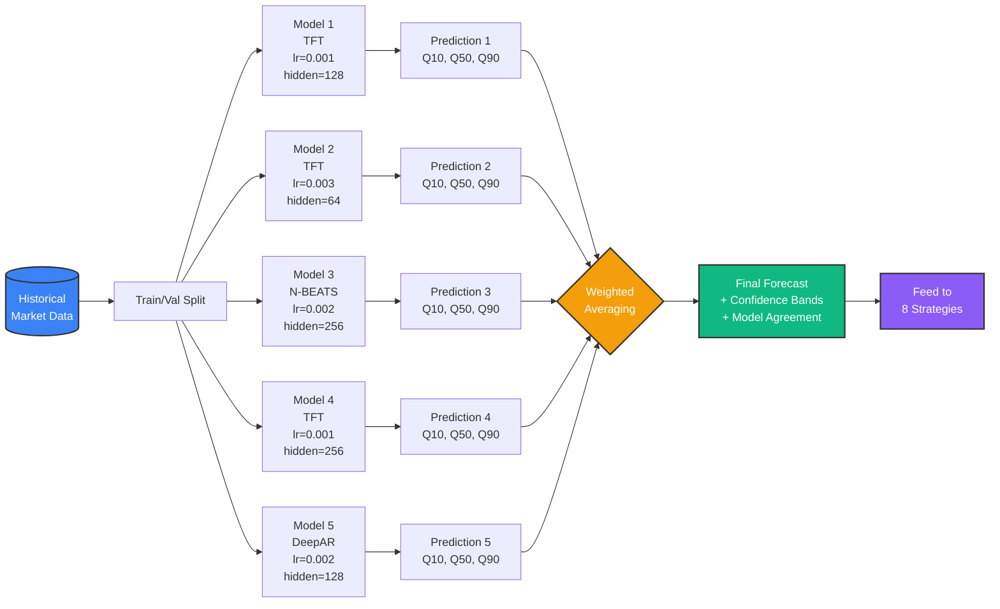
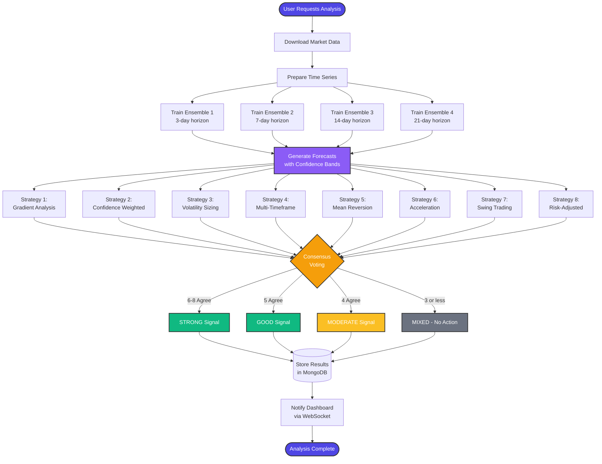
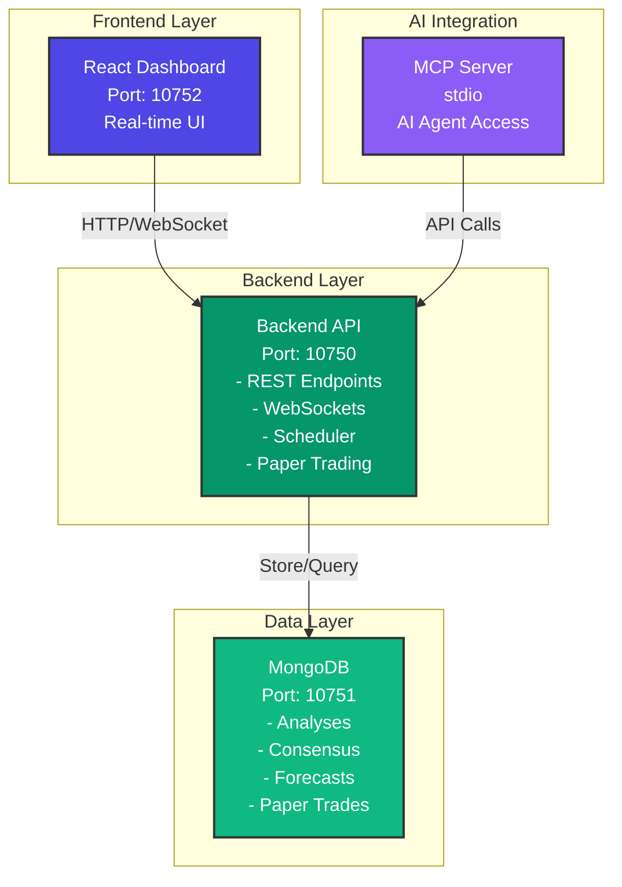
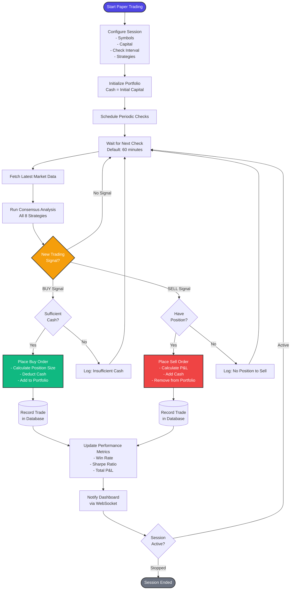
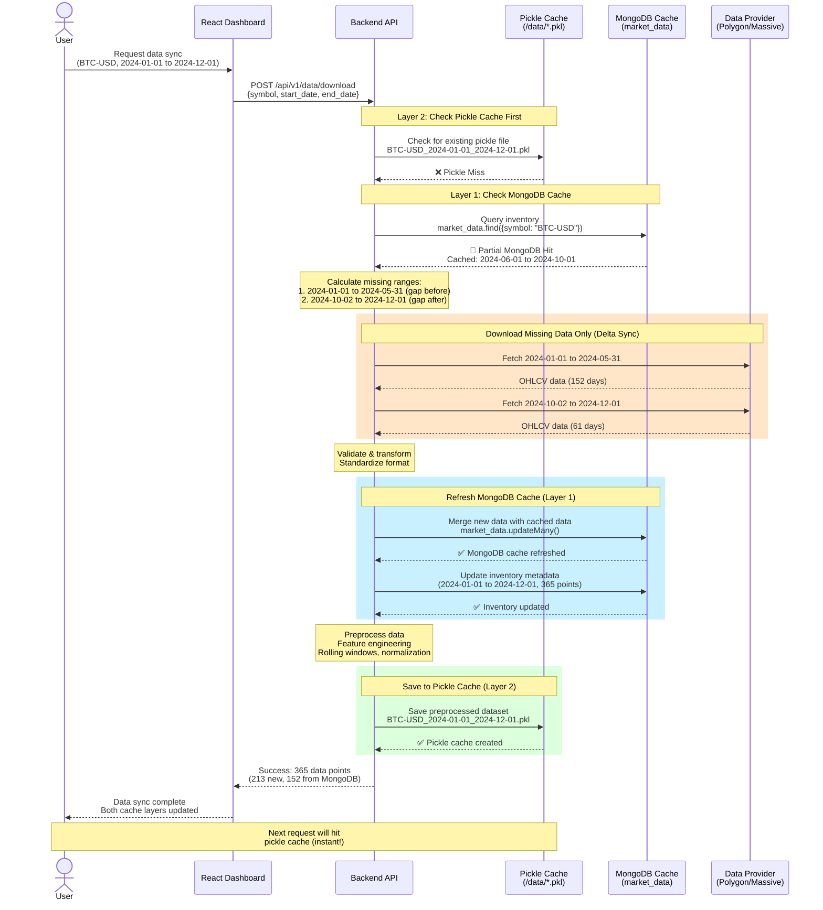
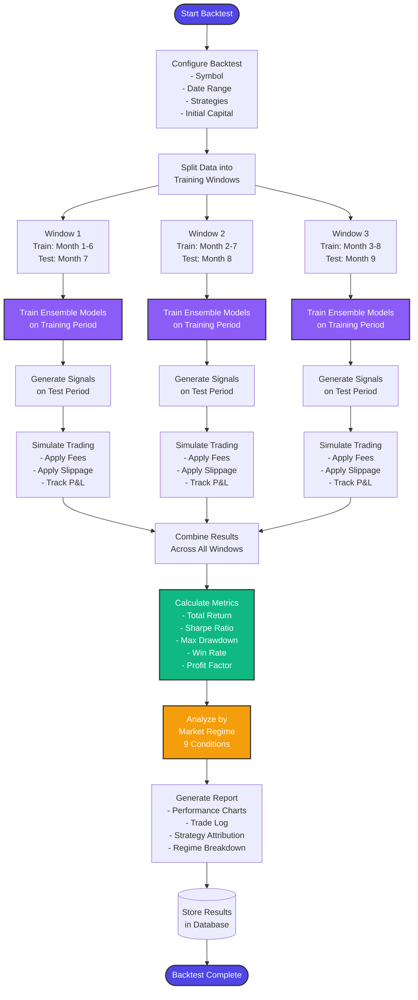

# Temporal Trading Agents

A next-generation trading system that combines deep learning time-series forecasting with ensemble methods and multi-strategy consensus voting to predict market movements and generate high-probability trading signals.

Built on top of [temporal-forecasting](https://github.com/OptimalMatch/temporal), this system uses advanced temporal models (Temporal Fusion Transformers) to forecast cryptocurrency and stock prices across multiple horizons, then transforms those forecasts into actionable trading signals through an 8-strategy consensus voting system.

---

## What is Temporal Forecasting?

**Temporal forecasting** is a deep learning approach that predicts future values of time-series data by learning patterns from historical sequences. Unlike traditional technical indicators that look at simple price patterns, temporal models capture complex, non-linear relationships across multiple time scales.

Our system uses **Temporal Fusion Transformers (TFT)**, a state-of-the-art architecture developed by Google Research that combines:

- **Attention mechanisms** - Automatically identifies which historical periods are most relevant for predictions
- **Multi-horizon forecasting** - Simultaneously predicts 3, 7, 14, and 21-day timeframes
- **Quantile predictions** - Provides uncertainty estimates with confidence bands, not just point forecasts
- **Feature importance** - Shows which inputs (price, volume, volatility) drive each prediction

This allows the system to understand not just *what* the price might be, but *how confident* we should be in that prediction and *which factors* are driving the forecast.

---

## Ensemble Learning Architecture

Rather than relying on a single model, our system uses an **ensemble of multiple temporal models**, each trained with different configurations:

### Ensemble Diversity

| **Different Architectures** | **Varied Hyperparameters** | **Multiple Horizons** |
|---|---|---|
| Multiple model types (TFT, N-BEATS, DeepAR) capture different aspects of market behavior | Different learning rates, hidden dimensions, and attention heads prevent overfitting to specific patterns | Separate ensembles trained for 3-day, 7-day, 14-day, and 21-day forecasts |

Each ensemble combines **5-8 individual models** using weighted averaging based on recent validation performance. This approach:

- **Reduces model-specific biases** - No single model's weaknesses dominate
- **Improves generalization** - Performs better on new, unseen market conditions
- **Provides uncertainty estimates** - Disagreement between models signals lower confidence
- **Adapts to regime changes** - Different models excel in different market environments

### Ensemble Learning Process



---

## How It Works: From Forecasts to Trading Signals

Raw temporal forecasts are transformed into actionable trading signals through an **8-strategy consensus system**. Each strategy analyzes the forecast from a unique perspective, providing a distinct lens on the same prediction data.

### The 8 Consensus Strategies

1. **Forecast Gradient Strategy** - Analyzes the *shape* of the forecast curve to identify patterns
   - U-shaped curves (dip then recovery) → Buy at predicted trough
   - Inverted-U curves (peak then decline) → Exit before predicted drop
   - Steep rises → Strong momentum plays
   - Gradual rises → Buy and hold opportunities

2. **Confidence-Weighted Strategy** - Scales position size by ensemble model agreement
   - HIGH confidence (80%+ models agree) → 100% position
   - MEDIUM confidence (65-80%) → 50% position
   - LOW confidence (55-65%) → 25% position
   - VERY LOW (<55%) → No trade

3. **Volatility Sizing Strategy** - Adjusts positions based on forecast uncertainty bands
   - VERY LOW volatility (<5% range) → Up to 150% position (using margin)
   - LOW volatility (5-10%) → 100% position
   - MEDIUM volatility (10-15%) → 50% position
   - HIGH volatility (15-20%) → 25% position
   - VERY HIGH volatility (>20%) → No trade or minimal position

4. **Acceleration/Momentum Strategy** - Detects changes in momentum over time
   - Accelerating gains (momentum increasing) → Buy signal
   - Decelerating gains (momentum slowing) → Take profits, trend exhaustion
   - Acceleration reversals (downtrend accelerating) → Stay out
   - Deceleration reversals (downtrend slowing) → Potential bottom forming

5. **Swing Trading Strategy** - Identifies multiple intra-forecast entry/exit opportunities
   - Uses peak/trough detection to find swing points within the forecast window
   - Calculates profit potential for each swing (requires minimum 2% moves)
   - Excellent opportunities: Multiple profitable swings detected
   - Good opportunities: 1-2 swings with solid profit potential

6. **Risk-Adjusted Strategy** - Comprehensive risk analysis using modern portfolio theory
   - Calculates Sharpe ratio (return vs. total volatility)
   - Calculates Sortino ratio (return vs. downside volatility only)
   - Measures maximum drawdown in forecast period
   - Estimates Value at Risk (VaR) and Conditional VaR (CVaR) for tail risk
   - Only trades when risk-adjusted metrics are favorable

7. **Mean Reversion Strategy** - Combines forecasts with technical indicators
   - Identifies oversold/overbought conditions using Z-scores and moving averages
   - **Validates** mean reversion signals against forecast direction
   - Filters out false signals where price appears mean-reverting but forecast disagrees
   - Only trades when technical setup AND forecast align

8. **Multi-Timeframe Alignment** - Cross-validates across all forecast horizons
   - Trains separate ensembles for 3, 7, 14, and 21-day horizons
   - ALL timeframes bullish → STRONG BUY (100% position)
   - Mostly bullish (3/4 agree) → BUY (75% position)
   - Short-term opportunity (short bullish, long bearish) → Quick trade (50%)
   - Mixed signals → Reduce or avoid
   - ALL timeframes bearish → STAY OUT

### Consensus Voting

Each strategy votes on every trading opportunity. A trade is only executed when **multiple strategies agree**. This consensus approach:

- **Filters false signals** - A single strategy's error is caught by others
- **Focuses on high-probability setups** - Multiple analytical perspectives must align
- **Adapts to market conditions** - Some strategies excel in trending markets, others in ranging
- **Provides conviction scoring** - 6-8 strategies agreeing = highest confidence trades

**Consensus Thresholds:**
- 🟢 **STRONG BUY**: 6+ strategies bullish
- 🟢 **BUY**: 5+ strategies bullish
- 🟡 **MODERATE BUY**: 4+ strategies bullish
- 🔴 **SELL/AVOID**: 4+ strategies bearish
- ⚪ **MIXED SIGNALS**: No clear consensus, avoid trading

### Analysis Flow



---

## Why Consensus Voting Works

The power of our system comes from **diversity of interpretation**. All 8 strategies use the same temporal forecasts, but analyze them in fundamentally different ways:

### The Three Consensus Scenarios

**When Strategies Agree (High Consensus)**
When 6-8 strategies align, it signals strong conviction. These high-consensus trades represent situations where multiple analytical perspectives—gradient analysis, confidence scoring, risk metrics, timeframe alignment—all point in the same direction. These are the highest-probability opportunities.

**When Strategies Disagree (Low Consensus)**
When only 3-4 strategies agree, it indicates conflicting signals. Perhaps the forecast shows a strong upward trend, but volatility is too high, or short-term and long-term horizons diverge. The system recognizes these uncertain situations and avoids them, preventing losses from ambiguous setups.

**Adaptive Meta-Learning**
Each strategy's voting weight can be dynamically adjusted based on recent performance. If mean reversion strategies are performing well in the current market regime, they get higher weight. If momentum strategies are struggling, their weight decreases. This creates a meta-learning system that adapts to changing market dynamics.

> **Key Insight:** This isn't just voting—it's combining different lenses on the same prediction. Like having 8 expert traders analyzing the same forecast, each bringing their unique perspective. When they all agree, confidence is high. When they disagree, it's a signal to stay cautious.

---

## Key Features

### Forecasting & Analysis
- **Multi-horizon Forecasting** - Generate predictions for 3, 7, 14, and 21-day timeframes simultaneously
- **Ensemble Methods** - Combine 5-8 models per horizon for robust, generalizable predictions
- **Uncertainty Quantification** - Confidence bands and model agreement scores for every forecast
- **Real-time Training Progress** - WebSocket updates during model training with live metrics

### Trading Strategies
- **8-Strategy Consensus System** - Multiple analytical perspectives voting on every opportunity
- **Dynamic Position Sizing** - Adjust position sizes based on confidence, volatility, and risk metrics
- **Comprehensive Risk Management** - Stop-loss, risk/reward ratios, VaR, CVaR, Sharpe/Sortino metrics
- **Multi-Timeframe Alignment** - Cross-validation across all forecast horizons

### Validation & Optimization
- **Backtesting Engine** - Walk-forward validation with realistic cost modeling (fees, slippage, spread)
- **Parameter Optimization** - Grid search across strategy combinations and parameters
- **Market Regime Analysis** - Track performance across 9 different market conditions
- **Paper Trading** - Simulated live trading to validate strategies before deploying capital

### Platform & Infrastructure
- **Modern Web Dashboard** - React-based UI with real-time updates and interactive charts
- **REST API** - Comprehensive FastAPI backend with full strategy analysis endpoints
- **MCP Server** - Model Context Protocol integration for AI agent access (Claude, etc.)
- **Docker Deployment** - Fully containerized architecture with MongoDB, backend, frontend, and MCP server
- **Automated Scheduling** - Create recurring analysis tasks (hourly, daily, weekly, custom cron)

---

## Docker Deployment

The project includes a complete Docker setup with React dashboard, REST API backend, MCP server for AI agent access, and MongoDB database with real-time WebSocket updates.

### Architecture



**Services:**
- **React Dashboard** (Port 10752): Modern web UI with real-time updates, charts, and scheduler management
- **Backend API** (Port 10750): FastAPI REST endpoints, WebSocket streaming, task scheduling, and paper trading engine
- **MCP Server**: Model Context Protocol server for AI agent integration (Claude, etc.)
- **MongoDB** (Port 10751): Database for storing analyses, consensus results, forecasts, schedules, and paper trading records

---

## Quick Start

### 1. Clone the repository
```bash
git clone https://github.com/yourusername/temporal-trading-agents.git
cd temporal-trading-agents
```

### 2. Configure environment variables
Copy the example environment file and add your API credentials:

```bash
cp .env.example .env
```

Then edit `.env` and add your API keys:
```bash
# Required: Add your data provider credentials
POLYGON_API_KEY=your_actual_polygon_api_key
MASSIVE_ACCESS_KEY_ID=your_actual_massive_access_key
MASSIVE_SECRET_ACCESS_KEY=your_actual_massive_secret_key
MASSIVE_API_KEY=your_actual_massive_api_key

# Other settings can remain at defaults
```

**Getting API Keys:**
- **Polygon.io**: Sign up at [polygon.io](https://polygon.io) for market data access
- **Massive.com**: Get credentials at [massive.com](https://massive.com) for S3 flat files

> **Note**: Without valid API keys, you won't be able to download market data. The system will still run, but data sync operations will fail.

### 3. Build and start all services
```bash
docker-compose up --build
```

### 4. Access the Dashboard
Open your browser and navigate to:
```
http://localhost:10752
```

The dashboard provides:
- **Dashboard Page**: Real-time overview with latest consensus signals and analytics
- **Analyze Page**: Trigger new 8-strategy consensus analyses for any symbol
- **Backtest Page**: Test strategy combinations on historical data with realistic costs
- **Optimize Page**: Find optimal parameters for your symbols and timeframes
- **Paper Trading Page**: Run simulated live trading to validate strategies
- **History Page**: Browse past analyses with filtering by symbol and strategy
- **Scheduler Page**: Create automated recurring analysis tasks
- **Data Sync Page**: Manage market data downloads and updates

### 5. Access the API (optional)
```bash
# Health check
curl http://localhost:10750/health

# Run comprehensive 8-strategy consensus analysis
curl -X POST http://localhost:10750/api/v1/analyze/consensus \
  -H "Content-Type: application/json" \
  -d '{"symbol": "BTC-USD", "horizons": [3, 7, 14, 21]}'

# Start paper trading session
curl -X POST http://localhost:10750/api/v1/paper-trading/start \
  -H "Content-Type: application/json" \
  -d '{
    "symbols": ["BTC-USD", "ETH-USD"],
    "initial_capital": 100000,
    "check_interval_minutes": 60
  }'
```

---

## Dashboard Features

### Real-Time Progress Tracking
- Live WebSocket connection shows training and analysis progress
- Progress bars with percentage completion
- Status indicators (starting, training, analyzing, completed, error)
- Detailed messages and metrics during model training
- Automatic reconnection on disconnect

### Strategy Analysis
- Run 8-strategy consensus analysis for any symbol
- Configure forecast horizons (3, 7, 14, 21 days)
- Popular symbols quick-select (BTC-USD, ETH-USD, AAPL, TSLA, etc.)
- View detailed consensus breakdown with bullish/bearish/neutral counts
- Interactive signal visualization with confidence scores and rationale

### Historical Analysis
- View past analyses with filtering by symbol and strategy type
- Separate views for individual strategy analyses and consensus results
- Date-sorted results with timestamps
- Signal badges (BUY, SELL, HOLD) color-coded by conviction
- Detailed metrics for every historical trade signal

### Paper Trading Dashboard
- Monitor active paper trading sessions in real-time
- View open positions, filled trades, and pending orders
- Track portfolio value, P&L, win rate, and Sharpe ratio
- Real-time signal monitoring with trade execution logs
- Pause/resume trading sessions with full state preservation

#### Paper Trading Workflow



### Backtesting & Optimization
- Test different strategy combinations and parameters
- Walk-forward validation with train/test splits
- Realistic cost modeling (fees, slippage, spread)
- Market regime analysis across 9 conditions
- Multi-objective optimization (Sharpe, return, drawdown)
- Interactive performance charts and detailed metrics

### Automated Scheduling
- Create recurring analysis tasks for multiple symbols
- Frequency options: Hourly, Daily, Weekly, Custom (cron expressions)
- Pause/resume scheduled tasks
- Track run history and next run time
- View all active and inactive schedules

### Data Management
- Download historical price data from Polygon.io or Massive.com
- Smart delta sync for extending date ranges (only downloads missing data)
- Pre-load datasets before running analyses
- View data inventory by symbol with date ranges
- Batch operations for multiple symbols

#### Data Sync Workflow

```mermaid
flowchart TD
    Start([User Requests<br/>Market Data]) --> Input[Specify Parameters<br/>- Symbol<br/>- Start Date<br/>- End Date<br/>- Preprocessing Options]

    Input --> CheckPickle{Check Pickle<br/>File Cache<br/>Layer 2}

    CheckPickle -->|🎯 Pickle Hit| LoadPickle[Load from Pickle<br/>/data/*.pkl<br/>⚡ Instant!]
    CheckPickle -->|Pickle Miss| CheckMongo{Check MongoDB<br/>Cache/Inventory<br/>Layer 1}

    LoadPickle --> Success

    CheckMongo -->|MongoDB Hit<br/>Full Range| UseMongo[Load from MongoDB<br/>🎯 Fast Path]
    CheckMongo -->|MongoDB Miss| FullDownload[Full Download<br/>Entire Date Range<br/>📥 Cold Start]
    CheckMongo -->|Partial Hit| DeltaSync[Smart Delta Sync<br/>Calculate Missing Ranges<br/>⚡ Efficient Path]

    UseMongo --> Preprocess1[Preprocess Data<br/>Feature Engineering]
    Preprocess1 --> SavePickle1[Save to Pickle Cache<br/>/data/*.pkl]
    SavePickle1 --> Success

    DeltaSync --> Ranges[Identify Gaps<br/>Before: Start → Cached Start<br/>After: Cached End → End]
    Ranges --> DeltaDownload[Download Only<br/>Missing Date Ranges]

    FullDownload --> Provider{Data<br/>Provider?}
    DeltaDownload --> Provider

    Provider -->|Polygon.io| PolygonAPI[Fetch from Polygon<br/>- OHLCV Data<br/>- API Rate Limiting<br/>- Retry Logic]
    Provider -->|Massive.com| MassiveAPI[Fetch from Massive<br/>- OHLCV Data<br/>- API Rate Limiting<br/>- Retry Logic]

    PolygonAPI --> Validate[Validate Data<br/>- Check Completeness<br/>- Verify Date Range<br/>- Check for Gaps]
    MassiveAPI --> Validate

    Validate --> Valid{Data<br/>Valid?}

    Valid -->|No| Error[Log Error<br/>Return Failure]
    Valid -->|Yes| Transform[Transform Data<br/>- Standardize Format<br/>- Add Timestamps]

    Transform --> Merge{Merging with<br/>MongoDB Data?}

    Merge -->|Yes| MergeData[Merge with Cached Data<br/>- Combine Ranges<br/>- Remove Duplicates<br/>- Sort by Date]
    Merge -->|No| RefreshMongo

    MergeData --> RefreshMongo[Refresh MongoDB Cache<br/>Store in market_data<br/>🔄 Update Layer 1]

    RefreshMongo --> Preprocess2[Preprocess Data<br/>Feature Engineering]
    Preprocess2 --> SavePickle2[Save to Pickle Cache<br/>/data/*.pkl<br/>🔄 Update Layer 2]

    SavePickle2 --> Success[Return Success<br/>Show Date Range<br/>Data Point Count]

    Error --> End([Sync Complete])
    Success --> End

    style Start fill:#4f46e5,stroke:#333,stroke-width:2px,color:#fff
    style CheckPickle fill:#f59e0b,stroke:#333,stroke-width:2px,color:#fff
    style LoadPickle fill:#10b981,stroke:#333,stroke-width:2px,color:#fff
    style CheckMongo fill:#f59e0b,stroke:#333,stroke-width:2px,color:#fff
    style UseMongo fill:#10b981,stroke:#333,stroke-width:2px,color:#fff
    style DeltaSync fill:#8b5cf6,stroke:#333,stroke-width:2px,color:#fff
    style Provider fill:#f59e0b,stroke:#333,stroke-width:2px,color:#fff
    style Validate fill:#f59e0b,stroke:#333,stroke-width:2px,color:#fff
    style Valid fill:#f59e0b,stroke:#333,stroke-width:2px,color:#fff
    style RefreshMongo fill:#06b6d4,stroke:#333,stroke-width:2px,color:#fff
    style SavePickle1 fill:#06b6d4,stroke:#333,stroke-width:2px,color:#fff
    style SavePickle2 fill:#06b6d4,stroke:#333,stroke-width:2px,color:#fff
    style Success fill:#10b981,stroke:#333,stroke-width:2px,color:#fff
    style Error fill:#ef4444,stroke:#333,stroke-width:2px,color:#fff
    style End fill:#4f46e5,stroke:#333,stroke-width:2px,color:#fff
```



**Dual-Layer Caching Architecture:**

The system uses a **two-tier caching strategy** to optimize performance:

**Layer 1: MongoDB Cache** (for raw market data)
- Raw OHLCV data stored in MongoDB `market_data` collection
- Indexed by symbol and date for fast range queries
- Survives container restarts (persisted to Docker volume)
- Enables concurrent access from multiple services
- Query inventory to check what data exists before downloading

**Layer 2: Pickle File Cache** (for preprocessed datasets)
- Preprocessed/transformed datasets cached as pickle files in `/data` directory
- Stores feature-engineered data ready for model training
- Includes time series transformations, rolling windows, normalized features
- Much faster to load than re-processing raw data
- Cache key includes symbol, date range, and preprocessing parameters

**Cache Hierarchy:**
```
User Request → Check Pickle Cache → Check MongoDB Cache → Download from Provider
     ↓              ↓ Hit: Load pkl        ↓ Hit: Process & pkl     ↓ Process, MongoDB, pkl
  Instant       Fast (seconds)         Medium (process time)     Slow (download + process)
```

**Why This Hybrid Approach?**
- ✅ MongoDB: Fast indexed queries, atomic updates, queryable by date range
- ✅ Pickle: Instant loading of preprocessed datasets (avoid re-computing features)
- ✅ Best of both: Raw data in DB, processed data on filesystem
- ✅ Flexible: Can rebuild pickle cache from MongoDB without re-downloading

**Key Features:**
- **Smart Cache Utilization**:
  - **Cache Hit (Full Range)**: Returns data instantly from MongoDB, no API calls
  - **Cache Miss**: Downloads full range from external provider, stores in MongoDB
  - **Partial Cache Hit**: Only downloads missing gaps, merges with cached MongoDB data
- **Smart Delta Sync**: Only downloads missing date ranges, saving API calls and time
- **Dual Provider Support**: Seamlessly switch between Polygon.io and Massive.com
- **Data Validation**: Ensures completeness and quality before storage
- **Inventory Tracking**: Maintains record of available data per symbol in MongoDB
- **Cache Refresh**: Automatically updates MongoDB cache with newly fetched data

#### Data Sync Sequence Diagram



---

## 8 Consensus Strategies Explained

Each strategy provides a unique analytical lens on the same temporal forecast. Here's how they work in detail:

### 1. Forecast Gradient Strategy
**Analyzes the SHAPE of the forecast curve**

Identifies and trades based on forecast patterns:
- **U-Shaped Curve**: Price dips then recovers → Buy at predicted trough, sell at recovery
- **Inverted-U Curve**: Price peaks then declines → Buy now, exit at peak before decline
- **Steep Rise**: Strong positive momentum → Enter immediately for full forecast period
- **Gradual Rise**: Steady upward trend → Buy and hold for full horizon
- **Decline**: Negative trajectory → Stay out or consider shorting

**Key Features:**
- Analyzes daily returns and curve gradients across the forecast window
- Identifies optimal entry/exit timing based on curve shape
- Detects local peaks and troughs within forecast horizon
- Calculates expected returns for each identified opportunity

**Signal Quality:** Best in trending markets with clear directional moves

---

### 2. Confidence-Weighted Ensemble Strategy
**Uses ensemble model agreement to determine position sizing**

Position sizing based on how many models agree:
- **HIGH confidence (80%+ agreement)**: 100% position - Nearly all models predict same direction
- **MEDIUM confidence (65-80% agreement)**: 50% position - Majority agree but some divergence
- **LOW confidence (55-65% agreement)**: 25% position - Weak majority, significant disagreement
- **VERY LOW (<55% agreement)**: No trade - Models split, too much uncertainty

**Key Features:**
- Measures percentage of ensemble models predicting above/below current price
- Calculates prediction standard deviation and coefficient of variation
- Dynamically adjusts position size based on model consensus
- Filters out trades where models disagree significantly

**Signal Quality:** Best for filtering out low-quality opportunities; excels in all market conditions when used as a filter

---

### 3. Volatility-Based Position Sizing
**Adjusts position size based on forecast uncertainty bands**

Dynamic sizing using the Q25-Q75 forecast range as a volatility measure:
- **VERY LOW volatility (<5% range)**: 150-200% position (can use leverage safely)
- **LOW volatility (5-10% range)**: 100-150% position (full to slightly leveraged)
- **MEDIUM volatility (10-15% range)**: 50-100% position (reduced exposure)
- **HIGH volatility (15-20% range)**: 25-50% position (minimal exposure)
- **VERY HIGH volatility (>20% range)**: 0-25% position (avoid or tiny speculative position)

**Key Features:**
- Uses quantile predictions (Q25-Q75 spread) as uncertainty proxy
- Implements Kelly Criterion for mathematically optimal position sizing
- Combines volatility-based sizing with Kelly recommendations
- Calculates position-adjusted risk/reward ratios

**Signal Quality:** Critical for risk management; prevents over-sizing volatile opportunities

---

### 4. Multi-Timeframe Trend Alignment
**Compares 3, 7, 14, and 21-day forecasts for alignment**

Trading signals based on timeframe consensus:
- **All 4 Bullish**: Strong buy signal (100% position) - All horizons aligned
- **3/4 Bullish**: Buy signal (75% position) - Strong majority agreement
- **Short-term Bullish + Long-term Bearish**: Quick trade opportunity (50% position) - Capture near-term move
- **2/4 or mixed**: Low conviction (25% or wait) - Conflicting signals across timeframes
- **All 4 Bearish**: Stay out completely - Clear downtrend across all horizons

**Key Features:**
- Trains separate ensembles for each of the 4 forecast horizons
- Identifies trend consistency across short, medium, and long-term views
- Higher conviction when all timeframes agree on direction
- Detects divergences (e.g., short-term rally in long-term downtrend)

**Signal Quality:** Excellent for avoiding whipsaws; best in sustained trending markets

---

### 5. Mean Reversion with Forecast Confirmation
**Trades mean reversion ONLY when the forecast confirms the reversion will occur**

Combines technical indicators with forecast validation:
- **OVERSOLD_REVERT**: Price below SMA, Z-score < -1.5 (oversold), AND forecast predicts upward reversion
- **OVERBOUGHT_REVERT**: Price above SMA, Z-score > 1.5 (overbought), AND forecast predicts downward reversion
- **FALSE_SIGNAL**: Mean reversion setup present BUT forecast contradicts expected move (no trade)
- **NO_SIGNAL**: No mean reversion opportunity detected

**Key Features:**
- Calculates 20-day and 50-day Simple Moving Averages
- Uses Z-score analysis to identify overbought/oversold conditions (-1.5 and +1.5 thresholds)
- Validates every mean reversion signal against forecast direction
- Filters out false signals where price appears mean-reverting but forecast disagrees
- Position sizing based on deviation magnitude

**Signal Quality:** Excellent for range-bound markets; poor in strong trends (intentionally avoids trend-following)

---

### 6. Acceleration/Deceleration Momentum Strategy
**Analyzes changes in momentum to identify accelerating or decelerating trends**

Compares momentum between early and late forecast periods:
- **ACCELERATING_GAINS**: Period 2 momentum > Period 1 momentum → Trend strengthening, enter or add
- **DECELERATING_GAINS**: Period 2 momentum < Period 1 momentum → Trend exhaustion, take profits or avoid
- **ACCELERATION_REVERSAL**: Negative momentum becoming more negative → Bearish acceleration, stay out
- **DECELERATION_REVERSAL**: Negative momentum slowing → Potential bottoming, watch for reversal

**Key Features:**
- Splits 14-day forecast into two 7-day periods
- Calculates daily return rate for each period
- Measures acceleration = Period 2 rate - Period 1 rate
- Positive acceleration (>0.2% daily) = strong buy signal
- Negative acceleration (<-0.2% daily) = trend exhaustion signal

**Signal Quality:** Best for identifying trend changes early; excels in transitioning markets

---

### 7. Swing Trading with Intra-Forecast Strategy
**Identifies multiple swing opportunities within the forecast window**

Uses peak/trough detection to find entry/exit points:
- **EXCELLENT_SWING_OPP**: Multiple profitable swings detected (3+ opportunities with >2% moves each)
- **GOOD_SWING_OPP**: 1-2 profitable swings available (solid profit potential per swing)
- **POOR_SWING_OPP**: Swings detected but profit potential too small (<2% per swing)
- **NO_SWING**: No clear swing pattern in forecast (trending or flat)

**Key Features:**
- Uses scipy.signal.argrelextrema to detect local maxima (peaks) and minima (troughs)
- Identifies multiple entry/exit opportunities within forecast window
- Calculates expected profit for each individual swing
- Requires minimum 2% price movement for valid swing
- Provides specific entry prices, exit prices, and expected returns

**Signal Quality:** Best in choppy, oscillating markets; poor in strong directional trends

---

### 8. Advanced Risk-Adjusted Strategy
**Comprehensive risk analysis using modern portfolio theory**

Evaluates opportunities using multiple risk metrics:
- **EXCELLENT_RISK_ADJUSTED**: Sharpe > 1.5, Sortino > 1.0, Max DD < 5%, favorable VaR/CVaR
- **GOOD_RISK_ADJUSTED**: Sharpe > 0.8, acceptable risk metrics across all categories
- **MODERATE_RISK**: Positive expected return but elevated risk (proceed with caution, reduced size)
- **POOR_RISK_ADJUSTED**: Negative Sharpe or unacceptable risk profile (avoid)

**Key Metrics:**
- **Sharpe Ratio**: Risk-adjusted return using total volatility (target > 1.5)
- **Sortino Ratio**: Risk-adjusted return using downside volatility only (target > 1.0)
- **Maximum Drawdown**: Worst peak-to-trough decline in forecast window (avoid if < -5%)
- **Value at Risk (VaR 95%)**: Expected loss at 95% confidence level
- **Conditional VaR (CVaR)**: Expected loss in worst 5% of scenarios (tail risk)
- **Risk-Adjusted Score**: Weighted composite of all metrics for final position sizing

**Signal Quality:** Universal filter for all market conditions; essential for capital preservation

---

## Technology Stack

### Forecasting Engine
- **PyTorch Forecasting** - Production-grade temporal models (TFT, N-BEATS, DeepAR)
- **PyTorch Lightning** - Distributed training infrastructure with GPU support
- **Polygon.io / Massive.com** - High-quality market data feeds (stocks, crypto, forex)
- **MongoDB** - Time-series optimized database for forecasts and analyses

### Trading System
- **FastAPI** - High-performance async API backend with WebSocket support
- **React + Vite + Tailwind** - Modern, responsive dashboard with real-time updates
- **Docker + Docker Compose** - Containerized deployment for reproducibility
- **NumPy / Pandas / SciPy** - Quantitative analysis and statistical computations

### Strategy Analysis
- **Advanced Risk Metrics** - Sharpe, Sortino, VaR, CVaR, Maximum Drawdown
- **Signal Processing** - scipy.signal for peak/trough detection and curve analysis
- **Statistical Analysis** - Z-scores, moving averages, volatility measures
- **Ensemble Methods** - Weighted model averaging with adaptive performance-based weighting

---

## Backtesting & Optimization

Every strategy and parameter combination can be rigorously tested before deploying capital.

### Walk-Forward Validation
- Simulates real-world trading with proper train/test splits
- Models retrained periodically as they would be in production
- Prevents overfitting by testing on unseen, out-of-sample data
- Rolling windows maintain temporal ordering (no look-ahead bias)

### Realistic Cost Modeling
- **Exchange Fees**: Maker/taker fee tiers for different exchanges
- **Bid-Ask Spread**: Realistic spread costs based on asset liquidity
- **Slippage**: Market impact modeling for different order sizes
- **SEC Fees**: Regulatory fees for equity trading

### Parameter Optimization
- Grid search across strategy parameter combinations
- Multi-objective ranking: Sharpe ratio, total return, maximum drawdown
- Strategy selection optimization: find which of the 8 strategies work best for each symbol
- Cross-validation to prevent overfitting to specific parameter sets

### Market Regime Analysis
Tracks performance across 9 distinct market conditions:
1. **Bull trending** - Strong upward momentum
2. **Bear trending** - Strong downward momentum
3. **High volatility** - Large price swings
4. **Low volatility** - Quiet, range-bound
5. **Mean-reverting** - Oscillating around average
6. **Momentum** - Sustained directional moves
7. **Choppy** - No clear pattern
8. **Breakout** - Range expansion
9. **Consolidation** - Range contraction

Identifies which strategies and parameters perform best in each regime, enabling adaptive strategy selection.

### Backtesting Workflow



---

## API Documentation

### Backend API Endpoints

**Base URL:** `http://localhost:10750`

#### Health & Status
```bash
GET /health
```

#### Analysis Endpoints
```bash
# Run 8-strategy consensus analysis
POST /api/v1/analyze/consensus
Content-Type: application/json
{
  "symbol": "BTC-USD",
  "horizons": [3, 7, 14, 21]
}

# Run individual strategies
POST /api/v1/analyze/gradient?symbol=BTC-USD
POST /api/v1/analyze/confidence?symbol=BTC-USD
POST /api/v1/analyze/volatility?symbol=BTC-USD
POST /api/v1/analyze/acceleration?symbol=BTC-USD
POST /api/v1/analyze/swing?symbol=BTC-USD
POST /api/v1/analyze/risk-adjusted?symbol=BTC-USD
POST /api/v1/analyze/mean-reversion?symbol=BTC-USD
POST /api/v1/analyze/multi-timeframe?symbol=BTC-USD
```

#### History & Analytics
```bash
# Get analysis history for a symbol
GET /api/v1/history/analyses/{symbol}?limit=10

# Get consensus history
GET /api/v1/history/consensus/{symbol}?limit=10

# Get comprehensive analytics
GET /api/v1/analytics/{symbol}
```

#### Paper Trading
```bash
# Start a paper trading session
POST /api/v1/paper-trading/start
Content-Type: application/json
{
  "symbols": ["BTC-USD", "ETH-USD"],
  "initial_capital": 100000,
  "check_interval_minutes": 60,
  "max_position_size": 0.1,
  "strategies": ["gradient", "confidence", "multi_timeframe"]
}

# Get active sessions
GET /api/v1/paper-trading/sessions

# Get session details
GET /api/v1/paper-trading/sessions/{session_id}

# Stop a session
POST /api/v1/paper-trading/stop/{session_id}
```

#### Backtesting & Optimization
```bash
# Run backtest
POST /api/v1/backtest/run
Content-Type: application/json
{
  "symbol": "BTC-USD",
  "start_date": "2024-01-01",
  "end_date": "2024-12-01",
  "strategies": ["gradient", "confidence", "multi_timeframe"],
  "initial_capital": 100000
}

# Run optimization
POST /api/v1/optimize/run
Content-Type: application/json
{
  "symbol": "BTC-USD",
  "start_date": "2024-01-01",
  "end_date": "2024-12-01",
  "optimization_target": "sharpe_ratio"
}
```

#### Data Management
```bash
# Download market data
POST /api/v1/data/download
Content-Type: application/json
{
  "symbol": "BTC-USD",
  "start_date": "2024-01-01",
  "end_date": "2024-12-01"
}

# Get data inventory
GET /api/v1/data/inventory

# Get data for a symbol
GET /api/v1/data/{symbol}?start_date=2024-01-01&end_date=2024-12-01
```

---

## MCP Server Usage

The MCP (Model Context Protocol) server allows AI agents like Claude to access trading strategies through a standardized protocol.

### Claude Desktop Configuration

Add to your Claude Desktop `claude_desktop_config.json`:

```json
{
  "mcpServers": {
    "temporal-trading": {
      "command": "docker",
      "args": [
        "exec",
        "-i",
        "temporal-trading-mcp",
        "python",
        "mcp-server/server.py"
      ]
    }
  }
}
```

### Available MCP Tools

- `analyze_gradient_strategy` - Run forecast gradient analysis
- `analyze_confidence_strategy` - Run confidence-weighted analysis
- `analyze_all_strategies` - Run all 8 strategies with consensus voting
- `get_analysis_history` - Get historical strategy analyses
- `get_consensus_history` - Get historical consensus results
- `get_symbol_analytics` - Get comprehensive symbol analytics

### Example Agent Usage

With the MCP server configured, AI agents can use natural language commands:
```
Analyze BTC-USD using all 8 trading strategies
Get consensus history for ETH-USD over the last month
What are the analytics for AAPL?
Show me the latest forecast gradient analysis for TSLA
```

---

## Environment Configuration

> **Quick Start Users**: If you followed the [Quick Start](#quick-start) section, you've already configured your `.env` file. This section provides additional details.

Copy `.env.example` to `.env` and add your API credentials:

```bash
cp .env.example .env
```

### Required Environment Variables

The `.env` file only requires **data provider credentials**. All other configuration (MongoDB, ports, services) is handled by `docker-compose.yml`.

```bash
# Data Provider Configuration

# Polygon.io API Key (for real-time market data)
POLYGON_API_KEY=your_polygon_api_key_here

# Massive.com S3 Configuration (for bulk historical data)
MASSIVE_ACCESS_KEY_ID=your_massive_access_key_id_here
MASSIVE_SECRET_ACCESS_KEY=your_massive_secret_access_key_here
MASSIVE_S3_ENDPOINT=https://files.massive.com
MASSIVE_S3_BUCKET=flatfiles
MASSIVE_API_KEY=your_massive_api_key_here
```

**Getting API Keys:**
- **Polygon.io**: Sign up at [polygon.io](https://polygon.io) - Free tier available for basic market data
- **Massive.com**: Get credentials at [massive.com](https://massive.com) - Provides bulk historical data via S3

### Service Configuration (docker-compose.yml)

All service configuration is managed in `docker-compose.yml`. No environment variables needed for:

**Ports** (automatically configured):
- Frontend Dashboard: `10752` → React UI
- Backend API: `10750` → FastAPI server
- MongoDB: `10751` → Database

**MongoDB**: Connection string and database name are hardcoded in docker-compose.yml

**Forecasting**: Default horizons (3, 7, 14, 21 days) and ensemble size (5 models) are set in the code

**CORS**: Configured in backend to allow dashboard access

> **Advanced Users**: To customize service configuration (ports, MongoDB settings, etc.), edit `docker-compose.yml` directly. The `.env` file is intentionally minimal to reduce configuration complexity.

---

## Database Management

### MongoDB Collections

- `strategy_analyses` - Individual strategy analysis results
- `consensus_results` - Multi-strategy consensus results
- `model_trainings` - Model training records and metrics
- `price_forecasts` - Forecast data with confidence bands
- `scheduled_tasks` - Automated analysis schedules
- `paper_trading_sessions` - Paper trading session configurations
- `paper_trades` - All simulated trades and orders
- `market_data` - Cached historical price/volume data

### Access MongoDB Shell

```bash
docker exec -it temporal-trading-mongodb mongosh
```

### Common MongoDB Commands

```javascript
// Switch to database
use temporal_trading

// View collections
show collections

// Query recent consensus results
db.consensus_results.find({symbol: "BTC-USD"}).sort({created_at: -1}).limit(5)

// Query strategy analyses
db.strategy_analyses.find({
  symbol: "BTC-USD",
  strategy_type: "gradient"
}).sort({created_at: -1}).limit(5)

// Get paper trading session stats
db.paper_trading_sessions.find({status: "active"})

// View recent trades
db.paper_trades.find({session_id: "session_id_here"}).sort({created_at: -1})

// Analytics aggregation
db.strategy_analyses.aggregate([
  {$match: {symbol: "BTC-USD"}},
  {$group: {
    _id: "$strategy_type",
    count: {$sum: 1},
    avg_confidence: {$avg: "$confidence"}
  }}
])
```

---

## Docker Commands

### Basic Operations

```bash
# Start services in detached mode
docker-compose up -d

# View logs (all services)
docker-compose logs -f

# View logs for specific service
docker-compose logs -f backend
docker-compose logs -f frontend
docker-compose logs -f mongodb
docker-compose logs -f mcp-server

# Stop services
docker-compose down

# Stop and remove volumes (WARNING: deletes database data)
docker-compose down -v

# Rebuild services after code changes
docker-compose up --build

# Check service health
docker-compose ps

# Restart a specific service
docker-compose restart backend
```

### Troubleshooting Commands

```bash
# Check if ports are in use
lsof -i :10750  # Backend
lsof -i :10751  # MongoDB
lsof -i :10752  # Frontend

# View resource usage
docker stats

# Clean up unused Docker resources
docker system prune -a

# Rebuild from scratch
docker-compose down -v
docker-compose build --no-cache
docker-compose up
```

---

## Troubleshooting

### Backend Fails to Start

**Symptoms:** Backend container exits immediately or health check fails

**Solutions:**
1. Check MongoDB is healthy: `docker-compose ps`
2. View backend logs: `docker-compose logs backend`
3. Ensure port 10750 is not in use: `lsof -i :10750`
4. Verify MongoDB connection: Check `MONGODB_URL` in `.env`
5. Wait 10-20 seconds for MongoDB to finish initializing on first start

### MongoDB Connection Issues

**Symptoms:** "Connection refused" or "No primary node" errors

**Solutions:**
1. Verify MongoDB is running: `docker-compose ps mongodb`
2. Check MongoDB logs: `docker-compose logs mongodb`
3. Wait for health check to pass (can take 10-20 seconds on first start)
4. Ensure port 10751 is not in use: `lsof -i :10751`
5. Verify Docker networking: `docker network ls` and `docker network inspect temporal-trading-agents_default`

### MCP Server Issues

**Symptoms:** Claude can't access MCP tools

**Solutions:**
1. Ensure backend is healthy: `curl http://localhost:10750/health`
2. View MCP logs: `docker-compose logs mcp-server`
3. Check `BACKEND_URL` environment variable points to `http://backend:8000`
4. Verify Claude Desktop config has correct Docker exec command
5. Restart Claude Desktop after config changes

### Out of Memory Errors

**Symptoms:** PyTorch training crashes with OOM errors

**Solutions:**
1. Increase Docker memory limit:
   - Docker Desktop: Settings → Resources → Memory
   - Recommended: 8GB+ RAM allocation
2. Reduce ensemble size in `.env`: `ENSEMBLE_SIZE=3` instead of `5`
3. Use smaller batch sizes for training
4. Train one horizon at a time instead of all 4 simultaneously

### Frontend Won't Load

**Symptoms:** Browser shows "Connection refused" or blank page

**Solutions:**
1. Check frontend container is running: `docker-compose ps frontend`
2. View frontend logs: `docker-compose logs frontend`
3. Ensure port 10752 is not in use: `lsof -i :10752`
4. Clear browser cache and hard refresh (Ctrl+Shift+R or Cmd+Shift+R)
5. Check CORS settings in backend `.env` file

### WebSocket Connection Drops

**Symptoms:** Real-time updates stop, "Disconnected" status in dashboard

**Solutions:**
1. Check backend is still running: `docker-compose ps backend`
2. View backend logs for WebSocket errors: `docker-compose logs backend`
3. Verify firewall isn't blocking WebSocket connections
4. Dashboard will auto-reconnect after 3 seconds; wait and refresh if needed

### Data Download Failures

**Symptoms:** "Failed to download data" errors in Data Sync page

**Solutions:**
1. Verify API keys are set in `.env` file
2. Check API provider status (Polygon.io or Massive.com)
3. Ensure date range is valid (not in future, not before asset inception)
4. View backend logs: `docker-compose logs backend | grep -i "data"`
5. Check rate limits on your API provider account

---

## Development Roadmap

### In Progress
- ✅ 8-strategy consensus system
- ✅ Real-time WebSocket progress updates
- ✅ Paper trading simulation engine
- ✅ Comprehensive backtesting framework
- ✅ Parameter optimization system
- ✅ MCP server for AI agent integration

### Planned Features
- [ ] **Live Trading Integration** - Connect to Alpaca, Binance, Interactive Brokers for real execution
- [ ] **Advanced Portfolio Management** - Multi-asset portfolio optimization and rebalancing
- [ ] **Sentiment Analysis Integration** - Incorporate news, social media, and on-chain metrics
- [ ] **Real-Time Data Feeds** - WebSocket streaming from exchanges for minute/second-level analysis
- [ ] **Multi-User Support** - User accounts, authentication, and isolated environments
- [ ] **Mobile App** - iOS and Android apps for on-the-go monitoring
- [ ] **Advanced Visualizations** - 3D forecast surfaces, interactive attention heatmaps
- [ ] **Custom Strategy Builder** - UI for creating custom strategies without coding
- [ ] **Alerting System** - Email, SMS, and push notifications for signals and events
- [ ] **Performance Analytics Dashboard** - Deep-dive into strategy performance with attribution analysis

---

## Contributing

Contributions are welcome! Whether it's bug fixes, new strategies, improved documentation, or feature requests, we appreciate your help.

### How to Contribute

1. Fork the repository
2. Create a feature branch: `git checkout -b feature/my-new-feature`
3. Make your changes with clear commit messages
4. Write tests if applicable
5. Update documentation as needed
6. Submit a pull request

### Development Setup

```bash
# Clone your fork
git clone https://github.com/yourusername/temporal-trading-agents.git
cd temporal-trading-agents

# Install dependencies
pip install -r requirements.txt
cd frontend && npm install

# Run tests
pytest
npm test
```

---

## License

See LICENSE file for details.

---

## Disclaimer

**This software is for educational and research purposes only.**

- Trading cryptocurrencies and stocks carries significant risk of financial loss
- Past performance does not guarantee future results
- This system provides signals and analysis, not financial advice
- Always do your own research before making investment decisions
- Never invest more than you can afford to lose
- Backtest results may not reflect real-world performance due to market impact, liquidity constraints, and changing market conditions
- Paper trading results do not include psychological factors of real trading

**Use at your own risk.** The authors and contributors are not responsible for any financial losses incurred through use of this software.

---

## Getting Started Workflow

Ready to start using Temporal Trading Agents? Follow this recommended workflow:

```mermaid
flowchart TD
    Start([New User]) --> Step1[1. Dashboard<br/>Get Familiar<br/>View latest signals<br/>Understand consensus voting]

    Step1 --> Step2[2. Data Sync<br/>Load Historical Data<br/>Download BTC-USD, ETH-USD<br/>Ensure sufficient history]

    Step2 --> Step3[3. Analyze<br/>Run First Analysis<br/>Trigger 8-strategy consensus<br/>Watch real-time progress]

    Step3 --> Step4[4. Backtest<br/>Validate on History<br/>Test strategies on past data<br/>See realistic performance]

    Step4 --> Decision{Results<br/>Promising?}

    Decision -->|No| Step5A[5. Optimize<br/>Find Best Parameters<br/>Discover optimal combinations<br/>Refine approach]
    Decision -->|Yes| Step6

    Step5A --> Step6[6. Paper Trade<br/>Simulate Live Trading<br/>Run for days/weeks<br/>Assess consistency]

    Step6 --> Monitor[Monitor Performance<br/>- Track P&L<br/>- Win Rate<br/>- Sharpe Ratio]

    Monitor --> Decision2{Paper Trading<br/>Successful?}

    Decision2 -->|No - Adjust| Step5A
    Decision2 -->|Yes| Step7[7. Go Live<br/>Real Trading<br/>Start small<br/>Scale gradually]

    Step7 --> Future[Future Feature<br/>Connect to exchanges<br/>Alpaca, Binance, etc.]

    style Start fill:#4f46e5,stroke:#333,stroke-width:2px,color:#fff
    style Step1 fill:#3b82f6,stroke:#333,stroke-width:2px,color:#fff
    style Step2 fill:#3b82f6,stroke:#333,stroke-width:2px,color:#fff
    style Step3 fill:#8b5cf6,stroke:#333,stroke-width:2px,color:#fff
    style Step4 fill:#10b981,stroke:#333,stroke-width:2px,color:#fff
    style Step5A fill:#f59e0b,stroke:#333,stroke-width:2px,color:#fff
    style Step6 fill:#10b981,stroke:#333,stroke-width:2px,color:#fff
    style Step7 fill:#059669,stroke:#333,stroke-width:2px,color:#fff
    style Decision fill:#f59e0b,stroke:#333,stroke-width:2px,color:#fff
    style Decision2 fill:#f59e0b,stroke:#333,stroke-width:2px,color:#fff
    style Future fill:#6b7280,stroke:#333,stroke-width:2px,color:#fff
```



### Workflow Steps Explained

**1. Dashboard - Get Familiar**
Start at the Dashboard page to see the latest consensus signals and overall system status. This gives you a feel for how strategies vote and what signals look like.

**2. Data Sync - Load Historical Data**
Go to the Data Sync page and download historical data for your target symbols (e.g., BTC-USD, ETH-USD, AAPL). The system needs sufficient history to train accurate models.

**3. Analyze - Run Your First Analysis**
Navigate to the Analyze page and trigger an 8-strategy consensus analysis. Watch the real-time progress as models train and strategies vote. Examine the results to understand each strategy's perspective.

**4. Backtest - Validate on History**
Use the Backtest page to test your chosen strategies on historical data. See how they would have performed with realistic costs. This builds intuition for which strategies work for which assets.

**5. Optimize - Find Best Parameters**
Run the Optimization engine to discover which parameter combinations and strategy subsets perform best for your symbols. Use the results to refine your trading approach.

**6. Paper Trade - Simulate Live Trading**
Start a Paper Trading session to validate your strategies in simulated real-time. This tests the full trading loop without risking capital. Monitor for several days or weeks to assess consistency.

**7. Go Live (Future)**
Once you're confident from paper trading results, you'll be able to connect to real exchanges (planned feature). Start with small position sizes and scale up gradually.

---

**Built with ❤️ using PyTorch, FastAPI, React, and MongoDB**
